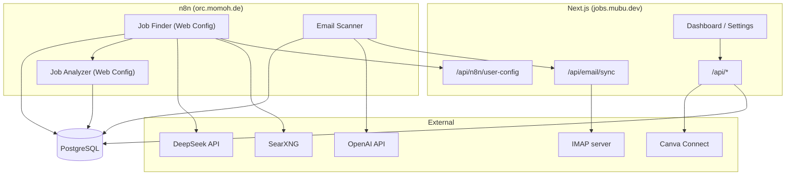

# Architecture

## System overview



## Web Config pattern

Older workflows read search settings via Postgres `get_search_config()`. **Web Config** workflows instead call:

```
GET /api/n8n/user-config?user_id={uuid}
Header: X-N8N-Secret: {N8N_INTERNAL_SECRET}
```

This returns merged settings: search queries, locations, DeepSeek key, min match score, SearXNG URL, etc. Settings are edited in the web UI under **Settings → Job Search**.

## Multi-user workflow provisioning

On user signup, `web/src/lib/n8n-provision.ts`:

1. Clones template workflows (`ROTREzXrgqrC8ffZ`, `inw6qMHWkng6OdKs`)
2. Patches **Fetch User Config** URL + secret
3. Patches **Manual Run Webhook** path (hash of secret + user ID)
4. Patches **Create Search Run** with user UUID
5. Stores workflow IDs on the user record

Each user gets private finder/analyzer instances. The **Email Scanner** is global (one workflow for all users).

## Key database functions

| Function | Used by |
|----------|---------|
| `get_search_config(user_id)` | Legacy + web API |
| `save_job_safe(jsonb)` | Analyzer → persist job + match |
| `should_skip_ai_analysis(...)` | Finder dedupe |
| `store_classified_email(...)` | Email scanner |
| `touch_job_last_seen(uuid)` | Re-seen jobs |

## Web feature modules

| Area | Main paths |
|------|------------|
| Auth | `/api/auth/*`, sessions in DB |
| Jobs | `/jobs`, `/api/jobs/[id]` |
| Applications | `/applications`, draft editor, export |
| Profile / CV | `/settings`, `/api/profile/*` |
| Canva | `/api/canva/*`, `canva_connections` table |
| Email | `/api/email/settings`, `/api/email/sync` |
| Search trigger | `/api/search-run/trigger` → n8n webhook |

## Security model

- Session cookies signed with `AUTH_SECRET`
- User API keys (DeepSeek, OpenAI) encrypted with `APP_ENCRYPTION_KEY`
- n8n internal API protected by `N8N_INTERNAL_SECRET`
- Canva tokens stored per user in `canva_connections` (encrypted refresh token)
- Row-level data scoped by `user_id` on jobs, applications, settings

## Docker layout

```
deploy/
  Dockerfile          # Multi-stage Next.js standalone build
  docker-compose.yml  # job-finder-web on supabase network
  .env.example
  restart-web.sh      # up -d --no-build
```

Build context is `web/` with `.dockerignore` excluding `.next` and `node_modules`.
